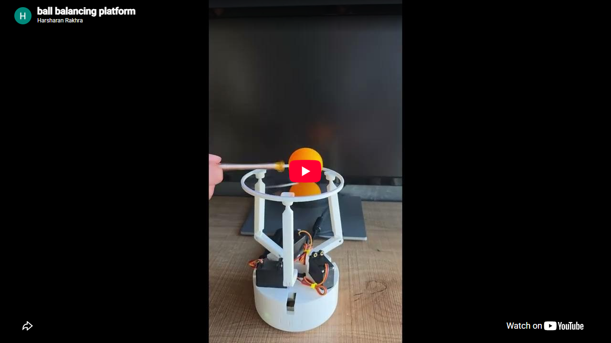
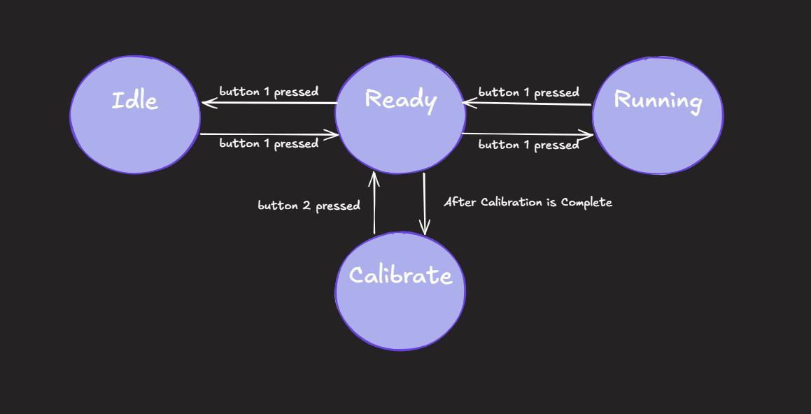
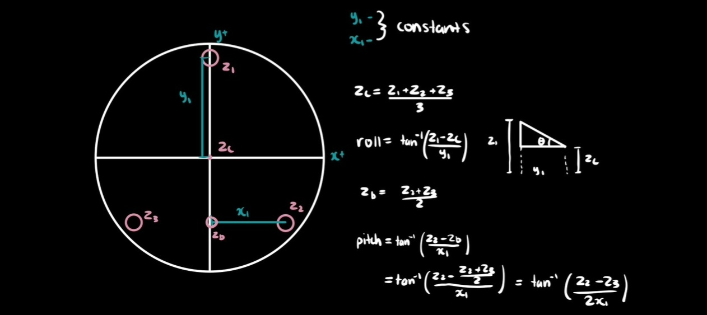
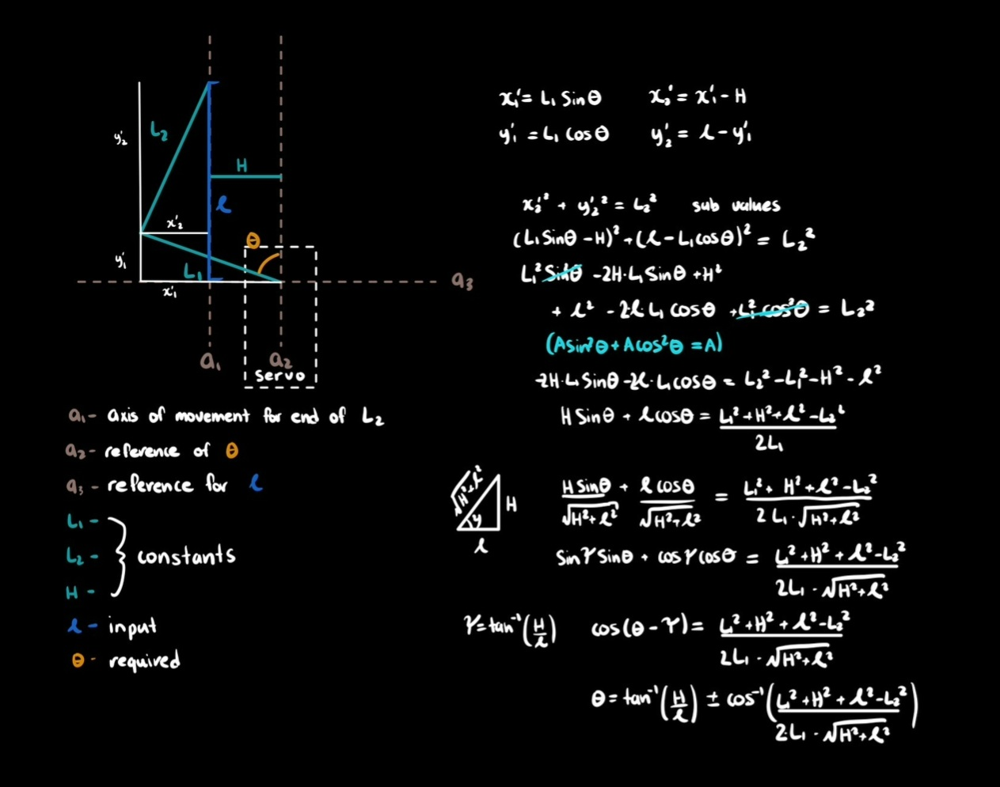

# Ball Balancing Table 

This project is a ball-balancing table that uses three servos to tilt a small platform and keep a ping pong ball centered on it. A Pi Camera tracks the ball at 35 FPS, and a Kalman filter cleans up the noisy readings into a smooth position and velocity estimate. That lets the balance controller run at 100Hz, so it's not stuck waiting on the camera. PID loops on roll, pitch, and height then use that estimate to keep the ball balanced in the middle.

## Demo
[](https://youtu.be/rpswAqHhNys?si=UYZartBwDwxu3crl)

## About this project

Three servo-actuated legs drive an RRS parallel linkage under a 120mm platform. A Pi Camera
tracks the ball's position via HSV colour masking, a Kalman filter smooths that into a
position + velocity estimate, and independent PID loops on roll/pitch/height keep the ball
centered.

## Getting Started

### Prerequisites

- Raspberry Pi (tested on a Pi 3B+) running Raspberry Pi OS, with a Pi Camera Module and an
  Adafruit PCA9685 servo hat wired over I2C
- `cmake` >= 3.16, a C++17 compiler
- System packages: `opencv4`, `libcamera`, `yaml-cpp`, `pigpio`, `wiringPi`

### Installation

```
./balance setup   # installs system packages, enables I2C, configures the CMake build dir
./balance build   # cmake --build build
```

### Usage

```
./balance run
```

Runs `sudo ./build/main`, since GPIO/I2C access requires root. Use the two GPIO buttons to
move between idle / ready / calibration / running states 

`./balance` is a thin wrapper around `scripts/setup.sh`, `scripts/build.sh`, and
`scripts/run.sh`, which can also be run directly.

## Implementation Details

### State Machine

The main source file runs a state machine that transitions through the following states:


State Description:

**Idle** - Initializes the camera, servos, and balance controller.

**Ready** - Raises the platform to a set height, preparing it for calibration or running.

**Calibrate** - Calibrates the camera's intrinsic values for the current lighting (AF, AE, analogue gain) and saves the ball's hue range.

**Run** - Detects the ping pong ball's position and height, balances it at the center, and catches it if it's falling off the platform.

### Camera Pipeline

The camera pipeline uses libcamera to get images from pi camera module 3.

Each libcamera frame buffer is `mmap`'d directly into a `cv::Mat` header. From there, the pipeline is ordered to shrink the image as early as
possible, before any of the more expensive per-pixel work runs:

1. **Crop to ROI, then downsample** a plain `cv::Mat` sub-view followed
   by `cv::resize`. The image is first cropped to only cover the area of the platform, then resized to reduce its quality to a point where there are enough pixels (10+) to define the ping pong ball at a 50 cm distance. Cropping/resizing first means every later stage runs on a much smaller
   image instead of the full sensor resolution.
2. **BGRA → BGR → HSV** colour conversion on the now-small frame.

   
3. **`cv::inRange`** thresholds against the calibrated HSV range, then `cv::erode` +
   `cv::dilate` clean up the mask in place, reusing the same buffer rather than allocating
   a new one each step.

   
4. **Contour detection** finds the largest contour in the mask and fits a minimum enclosing
   circle to get the ball's center and radius.

   

Doing the crop/resize before the colour conversion and masking is the main optimization as it's much cheaper to shrink one BGRA frame than to run HSV conversion, thresholding, and
morphology at full sensor resolution and shrink the result afterward. This lets the pipeline hit a steady **35 FPS on a Pi 3B+ with 1GB ram**.

### Balance Controller 

**Inverse Kinematics**

The inverse kinematics convert a desired platform roll, pitch, and height into the three servo angles needed to reach that pose. This is done in two steps: first, roll, pitch, and height are used to calculate the required height of each arm (center, left, right); then each arm height is converted into its corresponding servo angle using the geometry of the linkage (lower arm length, upper arm length, and axis offset), with a per-servo offset applied to correct for mechanical zero-point differences between the three servos, the derivations follow:

**Roll, pitch, height to arm heights:**


**Arm height to servo angle:**


**Kalman Filtering**

The raw ball position from the camera is noisy and only updates at camera framerate, so a Kalman filter (one each for x, y, and radius) fuses each new measurement into a smoothed position + velocity estimate. Between camera frames, the filter predicts forward using its own velocity estimate, so the control loop always has a fresh estimate even if a new frame hasn't arrived yet. This allowed the balance controller to run at 100Hz, fast enough to react before the ball rolls off the 120mm platform, and not be limited by the 35 FPS the camera pipeline was outputting.

**PID Control**

Three independent PID controllers run each cycle: roll and pitch use the ball's y and x position (plus the Kalman-estimated velocity as the derivative term) to tilt the platform toward center, while a height controller adjusts the platform's overall height based on the ball's estimated radius, effectively pushing the platform up or down to "catch" the ball as it approaches or moves away from the camera. Anti-windup and a derivative deadband are applied to prevent integral runaway and to reduce jitter from noisy velocity estimates.

**How it all connects**

Each control cycle: the filtered ball position feeds the PID loops, whose roll/pitch/height outputs are added to the platform's ready-state pose, converted to arm heights via inverse kinematics, and finally to servo angles, closing the loop between what the camera sees and where the servos move.

## Hardware

All STL files for the robot are available in assets/3d_models.

- **Compute:** Raspberry Pi 3B+ (1 GB RAM)
- **Camera:** Pi Camera Module 3
- **Servos:** 3× MG996R metal-gear servos
- **Servo driver:** Adafruit 16-channel PWM/Servo HAT (PCA9685) over I2C
- **Power:** Separate 5V/6V supply for the servos (Pi powered independently)
- **Platform:** 120mm diameter top plate with RRS parallel linkage
- **Buttons:** 2x 12x12x5mm Tactile 4 Pin Push Button Switch
- **LED:** Common Cathode RGB LED
