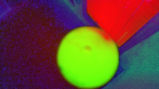
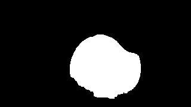
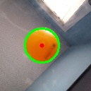

# Ball Balancing Table 

A small deskstop ping pong ball balancing machine that uses a Pi Camera Module 3 to track the ping pong ball, and uses three MG 996R on a 3 DOF Stewart type platform. Everything is done via Raspberry Pi 3B+ 1 GB ram with a adafruit servo hat. The goal was to explore computer vision, state estimation, and motion controls. 

## Demo


## About this project

Three servo-actuated legs drive an RRS parallel linkage under a 120mm platform. A Pi Camera
tracks the ball's position via HSV color masking, a Kalman filter smooths that into a
position + velocity estimate, and independent PID loops on roll/pitch/height keep the ball
centered.

## Getting Started

### Prerequisites

- Raspberry Pi (tested on a Pi 3B+) running Raspberry Pi OS, with a Pi Camera Module and an
  Adafruit PCA9685 servo hat wired over I2C
- `cmake` >= 3.16, a C++17 compiler
- System packages: `opencv4`, `libcamera`, `yaml-cpp`, `pigpio`, `wiringPi`

### Installation

```
./balance setup   # installs system packages, enables I2C, configures the CMake build dir
./balance build   # cmake --build build
```

### Usage

```
./balance run
```

Runs `sudo ./build/main`, since GPIO/I2C access requires root. Use the two GPIO buttons to
move between idle / ready / calibration / running states (see `CLAUDE.md` for details).

`./balance` is a thin wrapper around `scripts/setup.sh`, `scripts/build.sh`, and
`scripts/run.sh`, which can also be run directly.

## Implementation Details

### Camera Pipeline

The camera pipeline uses libcamera to get images from pi camera module 3.

Each libcamera frame buffer is `mmap`'d directly into a `cv::Mat` header — zero copy, no
`.clone()` needed. From there the pipeline is ordered to shrink the image as early as
possible, before any of the more expensive per-pixel work runs:

1. **Crop to ROI, then downsample** — a plain `cv::Mat` sub-view followed
   by `cv::resize`. The image is first cropped to only cover the area of the platform, then resized to reduce its quality to a point where there are enough pixels (10+) to define the ping pong ball at a 50 cm distance. Cropping/resizing first means every later stage runs on a much smaller
   image instead of the full sensor resolution.
2. **BGRA → BGR → HSV** color conversion on the now-small frame.

   
3. **`cv::inRange`** thresholds against the calibrated HSV range, then `cv::erode` +
   `cv::dilate` clean up the mask in place, reusing the same buffer rather than allocating
   a new one each step.

   
4. **Contour detection** finds the largest contour in the mask and fits a minimum enclosing
   circle to get the ball's center and radius.

   

Doing the crop/resize *before* the color conversion and masking is the main optimization:
it's much cheaper to shrink one BGRA frame than to run HSV conversion, thresholding, and
morphology at full sensor resolution and shrink the result afterward. 
